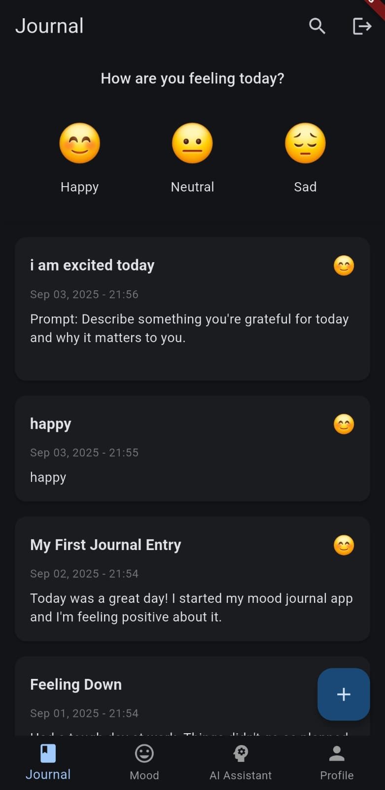
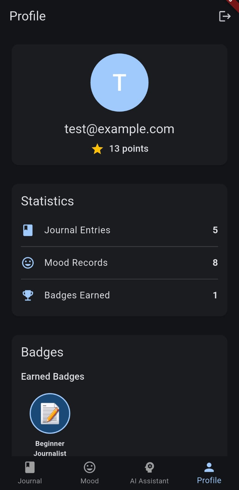

# MoodJournal Flutter App

A Flutter application for tracking mood and journaling, built for a technical assessment. The app helps users maintain their mental wellness by tracking moods, journaling thoughts, and receiving AI-powered insights.

## Features

### Core Features
- **Authentication**: Email/password login and registration with Firebase (mock implementation included)
- **Mood Tracking**: Log daily moods (happy, neutral, sad, angry, anxious) with timestamps
- **Journal Entries**: Add, edit, and delete journal entries with rich text formatting
- **AI Journaling Assistant**: Get personalized writing prompts, insights, and mood improvement suggestions
- **Badge System**: Earn badges for milestones like:
  - Beginner Journalist (5+ journal entries)
  - Emotion Tracker (7 consecutive days of mood tracking)
  - Deep Thinker (10+ journal entries)
  - Consistency Champion (14+ days of consistent usage)
  - Journaling Master (30+ journal entries)
- **Points System**: Earn points for every interaction to track your progress
- **Offline Mode**: Full functionality even without internet connection
- **API Integration**: Secure REST API calls with token-based authentication and error handling

### Technical Highlights
- **State Management**: Provider pattern for efficient state handling
- **Clean Architecture**: Separation of concerns with services, providers, and UI
- **Mock Implementation**: Fully functional without backend setup using SharedPreferences for data persistence
- **Error Handling**: Comprehensive error catching and user feedback
- **Responsive Design**: Works on various screen sizes
- **Dark Mode**: Customizable theme with dark mode support
- **Safe Data Handling**: Proper handling of asynchronous operations and navigation

## Screenshots

| Journal | Mood Tracker | AI Assistant | Profile |
|---|---|---|---|
|  |  |  |  |

The app features a clean, intuitive interface designed for daily journaling and mood tracking.

## Getting Started

### Prerequisites
- Flutter SDK (^3.9.0)
- Dart SDK (^3.3.0)

### Installation

1. Clone the repository
```bash
git clone https://github.com/yourusername/mood_journal_app.git
```

2. Install dependencies
```bash
cd mood_journal_app
flutter pub get
```

3. Run the app
```bash
flutter run
```

### Test Credentials
- Email: test@example.com
- Password: password123

## Project Structure

```
lib/
├── models/           # Data models
├── providers/        # State management
├── screens/
│   ├── auth/         # Authentication screens
│   ├── journal/      # Journal & mood tracking screens
├── services/         # API and business logic
├── utils/            # Helper functions
├── widgets/          # Reusable UI components
└── main.dart         # App entry point
```

## API Integration

The app demonstrates secure API integration with:
- Token-based authentication
- Automatic token refresh
- Error handling and retries
- Offline cache for uninterrupted usage

## Deployment Guide

The app is ready for deployment to both Android and iOS platforms:

### Android Deployment
1. Update the version in `pubspec.yaml`
2. Generate a signing key using `keytool` if you haven't already
3. Configure signing in `android/app/build.gradle`
4. Build release APK: `flutter build apk --release`
5. Test the APK on target devices
6. Upload to Google Play Console for distribution

### iOS Deployment
1. Update the version in `pubspec.yaml`
2. Configure signing certificates in Xcode
3. Build for iOS: `flutter build ios --release`
4. Archive the build in Xcode
5. Upload to TestFlight for testing
6. Submit for App Store review

Detailed deployment documentation is available in the `deployment/deployment_guide.md` file.

## AI Assistant Features

The AI Journaling Assistant offers several helpful features:

- **Personalized Writing Prompts**: Get tailored writing suggestions based on your current mood
- **Journal Entry Analysis**: Receive insights about the emotional tone of your entries
- **Mood Pattern Recognition**: Identify trends in your mood over time
- **Activity Recommendations**: Get suggestions for activities that may improve your mood

## Recent Updates

- Fixed journal entry deletion crash
- Improved badge awarding logic to strictly enforce requirements
- Enhanced UI for badges display
- Improved profile screen data refresh
- Fixed point calculation and tracking

## Future Enhancements

- Social sharing of mood insights
- Enhanced analytics and reporting
- Cloud synchronization
- Customizable journal templates
- Multilanguage support

## Troubleshooting

If you encounter any issues:

1. Ensure you have the latest Flutter SDK installed
2. Run `flutter clean` followed by `flutter pub get`
3. Check for any specific error messages in the console
4. For persistent issues, please open an issue on the GitHub repository

## License

This project is licensed under the MIT License - see the LICENSE file for details.

## Contact

For questions or feedback about this technical assessment submission, please contact me at ammarbinshakir557@gmail.com
